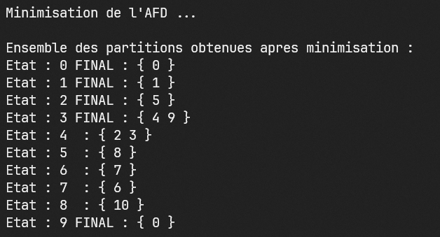

# regexDFA_builder
Construct a minimal DFA from a regular expression using Thompson, determinisation, and minimisation algorithms.




## Usage example

To start the DFA builder, run the following command.
```sh
./regexdesc
```

This DFA builder was optimised by using char type to store a maximum of 8 state in a bitwise manner (as using array of int would have taken much more space to store boolean data).

## Meta

[Gabriel Combe-Ounkham](https://github.com/gabriel-combe)

Distributed under the GNU GENERAL PUBLIC license. See ``LICENSE`` for more information.
